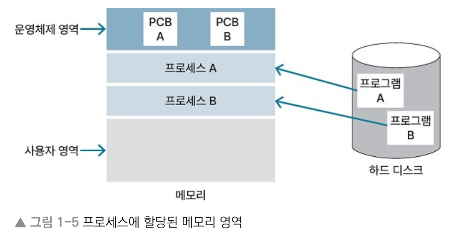
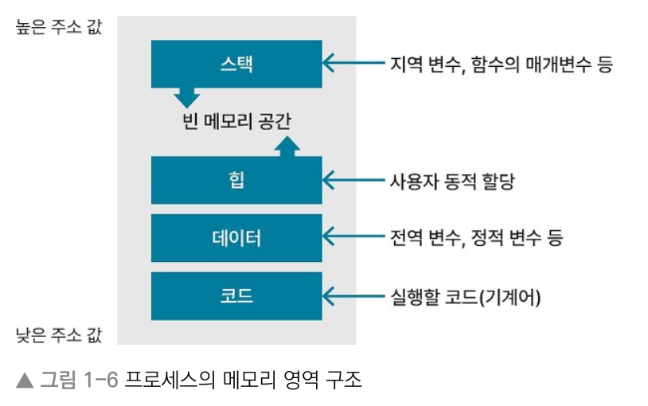
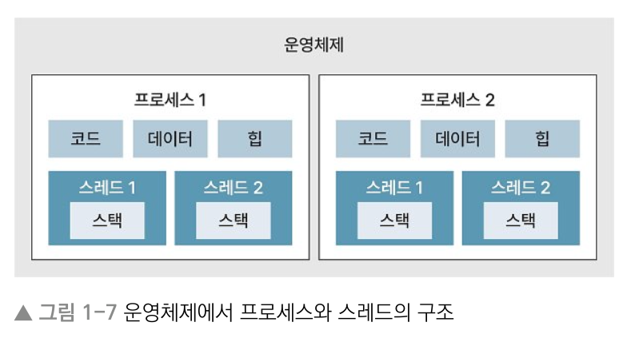
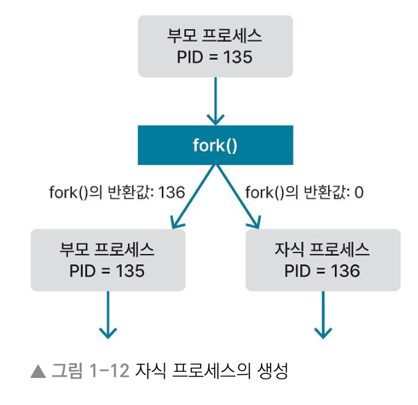
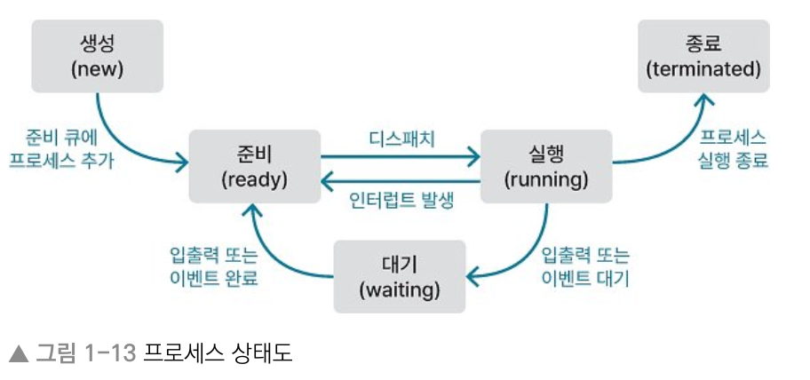
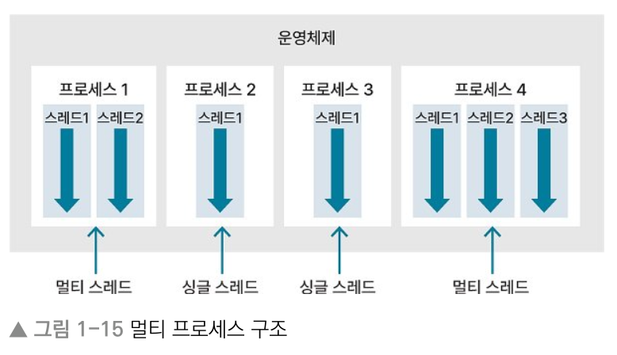
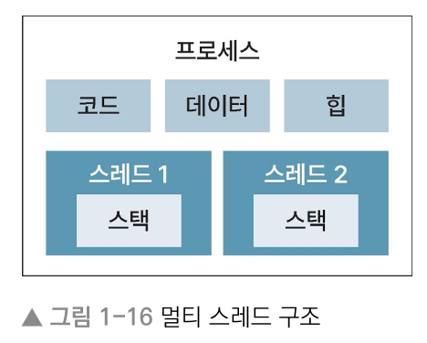
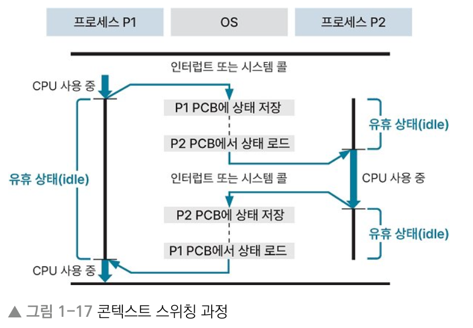

# 1장 운영체제
## 1.2 프로세스
> Keyword : 프로그램, 프로세스, 스레드(사용자레벨/커널레벨), PCB, fork(), 

### 프로세스와 스레드
#### 프로그램
- 특정 작업을 수행하기 위한 명령어의 집합
- OS는 프로그램을 실행하면서 디스크에 저장된 데이터를 메모리로 로드

#### 프로세스
- 컴퓨터에서 실행 중인 하나의 프로그램
- OS로부터 독립된 메모리 영역(코드, 데이터, 스택, 힙)을 할당받음
- 다른 프로세스의 메모리 영역에 접근할 수 없다

#### 프로세스에 할당된 메모리 영역

#### 프로세스의 메모리 영역 구조

- 스택(stack) : 지역 변수, 함수의 매개변수(parameter), 반환되는 주소 값 등이 저장. 높은 주소 값에서 낮은 주소 값으로 메모리가 할당(LIFO). 영역 크기는 컴파일 시 결정.
- 힙(heap) : 사용자에 의해 동작 메모리 할당이 일어나는 영역. 낮은 주소 값에서 높은 주소 값으로 메모리가 할당됨(FIFO). 영역 크기는 런타임 때 결정.
- 데이터(data) : 전역변수, 정적변수, 배열, 구조체 등이 저장. 세부적으로 BSS(초기화하지 않은 변수) 영역과 데이터 영역(초기화한 변수)으로 나뉨.
- 코드(code) : 실행할 코드가 기게어로 컴파일되어 저장되는 영역. 텍스트 영역이라고도 함.

#### 스택 오버플로 / 힙 오버플로
- 스택, 힙은 동적으로 메모리 할당이 가능해서 사이에 빈 메모리 공간 존재.
- 메모리 영역을 공유해서 서로의 영역을 침범하는 문제 발생.
- 스택 오버플로 : 스택 영역이 힙 영역 침범
- 힙 오버플로 : 힙 영역이 스택 영역 침범

#### 스레드
- 프로세스에서 실제로 실행되는 흐름의 단위
- 프로세스는 한 개 이상의 스레드를 가진다
- 프로세스 안에 존재해서 프로세스의 메모리 공간을 이용함
- 지역변수를 저장하는 스택 영역을 할당 받는다
- 전역변수를 저장하는 힙 영역은 다른 스레드와 공유

#### 운영체제에서 프로세스와 스레드의 구조

#### 사용자 레벨 스레드와 커널 레벨 스레드
- 커널에서 관리하는 자원을 보호하기 위해 사용자모드와 커널모드로 구분
- 스레드도 스레드를 관리하는 주체에 따라 구분됨
- 사용자 레벨 스레드(사용자가 라이브러리를 이용해 생성 및 관리) / 커널 레벨 스레드(커널이 스레드를 생성 및 관리)

#### 사용자 레벨 스레드와 커널 레벨 스레드의 3가지 관계
1. 다대일 모델 : 사용자 n개에 커널 1개 매핑. 사용자 레벨에서 스레드 관리. 하나의 사용자 레벨 스레드에서 시스템 콜 호출시 나머지는 커널 레벨에 접근 불가하므로 멀티 코어의 병렬성 이용 불가.
2. 일대일 모델 : 하나의 사용자 레벨 스레드에서 시스템 콜 호출 시 다른 사용자 레벨 스레드가 모두 실행되지 않는 다대일 모델 단점 해결. 하지만 사용자 레벨 스레드 수만큼 커널 레벨 스레드가 생성되어 성능 저하 가능성.
3. 다대다 모델 : 커널 레벨 스레드의 수는 사용자 레벨 스레드의 수 이하. 구현이 어려움.

### PCB (Process Control Block, 프로세스 제어 블록)
- OS는 프로세스 제어를 위해 프로세스 정보를 저장
- 프로세스의 현재 상태, 프로세스를 나타내는 고유의 PID(Process ID), 부모&자식 프로세스의 PID, PC, 프로세스의 우선순위, 메모리 제한 등 저장
- PC(Program Counter) : 다음 실행할 명령어의 주소

### 프로세스의 생성 (fork() 함수)
- 기존 프로세스에서 fork() 함수를 호출해서 새 프로세스 생성
- fork() 함수에는 함수를 호출한 프로세스를 복사하는 기능 있음
- 부모 프로세스 : 기존 프로세스 / 자식 프로세스 : 복사된 프로세스
- 부모 프로세스에서 fork() 호출 시 부모 프로세스는 자식 프로세스의 PID 값을, 자식 프로세스는 0을 반환

#### OS가 프로세스를 종료하는 경우
- 프로세스가 운영체제의 종료 서비스(exit())를 호출해 정상 종료할 때
- 프로세스의 실행 시간 또는 특정 이벤트 발생을 기다리는 시간이 제한된 시간을 초과한 경우
- 프로세스가 파일 검색 또는 입출력에 실패하는 경우
- 오류가 발생하거나 메모리 부족 등이 발생하는 경우

#### 부모 프로세스가 자식 프로세스를 종료시킬 수 있는 경우
- 자식 프로세스가 할당된 자원을 초과해서 사용할 때
- 자식 프로세스에 할당된 작업이 없을 때

### 프로세스 상태도

- 모든 프로세스는 CPU에 의해 생성되고 소멸하는 과정 거침
- 승인 : CPU를 제외한 다른 자원이 준비되어 해당 프로세스가 준비 상태가 될 수 있게 OS가 허락하는 것
- 디스패치 : 프로세스에 CPU 자원을 할당해 해당 프로세스가 준비 -> 실행 되는 것

#### 프로세스의 5가지 상태
- 생성(new) : 프로세스가 PCB 갖고 있지만 OS로부터 승인 받기 전
- 준비(ready) : OS로부터 승인받은 후 준비 큐에서 CPU 할당 기다림
- 실행(running) : 프로세스가 CPU 할당받아 실행
- 대기(waiting) : 프로세스가 입출력이나 이벤트 발생을 기다려야 해서 CPU 사용 멈추고 기다림
- 종료(terminated) : 프로세스 실행을 종료

#### 프로세스의 상태 변화
- 생성 -> 준비 : 프로세스가 OS로부터 승인 받아서, 준비 상태의 프로세스가 모여있는 준비 큐에 추가 됨
- 준비 -> 실행 : 준비 큐에 있는 프로세스 중 우선순위가 높은 프로세스가 디스패치되어 실행됨
- 실행 -> 준비 : CPU 독점을 방지하기 위해 타임아웃되어 준비 상태로 변경됨
- 실행 -> 대기 : 입출력 또는 이벤트 때문에 대기 상태로 변경됨
- 대기 -> 준비 : 입출력 또는 이벤트가 완료되어 준비 상태로 변경됨
- 실행 -> 종료 : 실행 중인 프로세스가 정상적으로 끝나서 종료 상태로 변경됨

### 멀티 프로세스와 멀티 스레드
#### 동시성과 병렬성
- 동시성(concurrency) : 하나의 코어(싱글 코어)에서 여러 작업을 번갈아 가면서 처리하는 방식.
  - 콘텍스트 스위칭 : 하나의 CPU에서 여러 작업을 번갈아 가면서 처리하기 위해 처리 중인 작업을 교체하는 것
- 병렬성(parallelism) : CPU가 여러 개(멀티 코어) 있어서 각 CPU에서 각 작업을 동시에 처리하는 방식

#### 멀티 프로세스
- 응용 프로그램 하나를 여러 프로세스로 구성하는 것
- 한 프로세스가 죽어도 다른 프로세스에 영향 주지 않음
- 응용 프로그램을 프로세스 하나로 구성하는 것보다 여러 개로 구성하는 것이 안정적
- 단점 : 시간과 메모리 공간을 많이 사용
- 오버헤드 : 콘텍스트 스위칭 작업을 할 때, CPU에서 기존에 처리하던 프로세스가 할당 받은 메모리 영역을 다른 프로세스에서 사용할 수 있게 교체하면서 필요한 시간과 메모리
- IPC : 프로세스는 독립적인 메모리를 할당받기 때문에, 프로세스간에 공유할 자원이 있으면 IPC로 공유해야 한다. 공유할 메모리를 직접 참조하는 것보다 비효율적.

#### 멀티 프로세스 구조

#### 멀티 스레드
- 스레드를 여러 개 생성해서 스레드들이 각자 다른 작업을 처리
- 스레드 간에 힙, 데이터, 코드 영역 공유 (스택 제외)
  - 콘텍스트 스위칭할 때 오버헤드가 적게 발생. <-레지스터에 저장하고 로드해야하는 데이터가 적어서
  - IPC 사용하지 않아도 되어서 멀티 프로세스의 단점 보완
- 독립적인 메로리 공간을 갖는 프로세스를 여러 개 생성하는 것보다 스레드를 여러 개 생성하는 것이 자원을 효율적으로 사용 가능
- 스레드 간 자원 공유가 프로세스 간 자원 공유보다 시스템 처리 비용이 적고 프로그램 응답 시간도 단축됨
- 단점 : 스택 영역을 다른 스레드와 함께 사용해서 공유 자원에 대한 동기화 필수. 
- 단점 : 스레드에 문제 생기면 프로세스 내 다른 스레드에 영향 미칠 수 있음.

#### 멀티 스레드 구조

### 콘텍스트 스위칭
#### 인터럽트
- CPU에서 프로세스를 처리하다가 입출력 관련 이벤트가 발생하거나 예외 상황이 발생할 때 이에 대응할 수 있게 CPU에 처리를 요청하는 것
- 입출력 발생, CPU 사용 시간 만료, 자식 프로세스 생성 등에서 인터럽트 발생

#### 콘텍스트 스위칭
- 콘텍스트 : CPU가 처리하는 프로세스의 정보
- 멀티 프로세스 환경에서 CPU가 처리 중인 프로세스의 정보를 바꾸는 것
- CPU는 한번에 하나의 작업만 처리할 수 있어서 멀티 프로세스를 처리하려면 CPU 스케줄러에 의해 인터럽트가 발생하면서 콘텍스트 스위칭 발생
- PCB에 프로그램 카운터와 스택 포인터 값이 저장되어 있어서 CPU에서 처리 중인 프로세스가 변경되어도 이어서 실행 가능.
- PC (프로그램 카운터) : 프로세스가 이어서 처리해야 하는 명령어의 주소 값
- 스택 포인터 : 스택 영역에서 데이터가 채워진 가장 높은 주소 값

#### 콘텍스트 스위칭 과정

- 오버헤드가 발생한다 : 어떤 처리를 하는 데 간접적인 처리시간과 메모리가 소요됨
  - ex. P1의 PCB에 P1 정보 저장하고, P2의 PCB에 저장된 정보를 레지스터에 로드할 때 CPU 아무일도 못함.
- 멀티 프로세스의 콘텍스트 스위칭보다 멀티 스레드의 콘텍스트 스위칭이 시간과 메모리 자원을 적게 사용

### 프로세스 동기화
#### 경쟁 상태
- 공유 자원에 동시에 접근해서 경쟁하는 상태
- 여러 프로세스 또는 스레드에서 하나의 공유 자원에 접근할 때, 자원 접근 순서에 따라 결과 값 달라질 수 있음

#### 임계 영역
- 공유 자원에 접근할 수 있고 접근 순서에 따라 결과가 달라지는 코드 영역
- 임계 영역에서 경쟁 상태가 발생하는 것을 방지하려면 여러 프로세스가 공유 자원에 접근해도 데이터의 일관성이 유지되도록 프로세스 동기화 해야 함

#### 임계 영역에 여러 접근이 동시에 발생하는 것을 방지하기 위한 조건
1. 상호배제 기법(mutual exclusive) : 어떤 프로세스가 임계 영역을 실행 중일 때 다른 프로세스가 임계 영역에 접근 불가. 뮤텍스와 세마포어.
2. 진행 (progress) : 임계 영역을 실행 중인 프로세스가 없을 때 다른 프로세스가 임계 영역 실행
3. 한정된 대기 (bounded waiting) : 임계 영역에 접근을 요청했을 때 무한한 시간을 기다리지 않는다

#### 뮤텍스
- 락(lock)을 가진 프로세스만이 공유자원에 접근할 수 있게 하는 방법
- 뮤텍스와 세마포어는 상호배제 기법
- 임계 영역에 먼저 접근한 프로세스가 임계 영역에 락을 걸면 다른 프로세스들은 해당 프로세스가 락을 해제하기 전까지 대기해야 한다
- ex. 화장실과 화장실 열쇠가 하나뿐인 식당
- 락킹 매커니즘 : 임계 영역에 접근한 프로세스가 임계 영역에 락을 건다고 해서 락킹 매커니즘이라고도 함

#### 스핀락
- 락을 얻기 위해 프로세스가 반복문을 돌면서 기다리는 것
- 임계 영역에 접근하지 못한 프로세스가 대기 상태가 되지 않고 반복문을 돌면서 자원의 사용 가능 여부를 확인해서 프로세스가 빠르게 교체될 수 있다.
- 바쁜 대기의 한 종류
- 바쁜 대기 : 프로세스가 공유 자원에 접근할 수 있는 권한을 얻을 때까지 확인하는 과정

#### 세마포어
- 공유 자원에 접근할 수 있는 프로세스의 수를 정해 접근을 제어하는 방법
- 임계 영역에 접근할 수 있는 키 n개를 지정하고 이중 하나를 가진 프로세스만 임계 영역에 접근하게 하는 방식
- ex. 화장실과 화장실 열쇠가 n개인 식당
- 시그널링 메커니즘 : 공유 자원에 접근한 프로세스가 접근을 해제하면 다른 프로세스가 접근할 수 있도록 신호를 보낸다고해서 이렇게도 부름

#### 용어 정리 (동기, 비동기, 블로킹, 넌블로킹)
- 동기/비동기는 작업 순서에 대한 개념
- 블로킹/넌블로킹은 작업을 위한 대기를 구분하는 개념
- 동기(synchronization) : 여러 작업을 처리할 때 작업 순서를 보장함
- 비동기(asynchronization) : 여러 작업을 처리할 때 작업 순서를 보장하지 않음
- 블로킹(blocking) : 작업을 수행할 때 대기할 수 있다는 것을 의미하며 작업 순서를 보장하지 않음
- 넌블로킹(non-blocking) : 작업을 시작하면 대기 없이 수행한다는 것을 의미

### 교착 상태
#### 교착 상태
- 상호배제 기법 때문에 2개 이상의 프로세스가 각각 자원을 가지고 있으면서 서로의 자원을 요구하며 기다리는 상태

#### 교착 상태 발생 4가지 필요 충분 조건
- 상호배제 (mutual exclusion) : 하나의 공유 자원에 하나의 프로세스만 접근 가능
- 점유와 대기 (hold and wait) : 프로세스가 최소 하나의 자원을 점유하고 있는 상태에서 추가로 다른 프로세스에서 사용 중인 자원 점유를 위해 대기
- 비선점 (non-preemption) : 다른 프로세스에 할당된 자원을 뺏을 수 없다
- 환형 대기 (circular wait) : 프로세스가 자신의 자원을 점유하면서 앞이나 뒤에 있는 프로세스의 자원을 요구 

### 스레드 안전
멀티 스레드 환경에서 하나의 변수, 함수, 객체에 스레드 여러 개가 동시에 접근해도 문제 없음을 의미

### IPC (Inter Process Communication)
- 프로세스 간에 자원을 공유하는 방식
1. 공유 메모리 : 프로세스 간 공유 가능 메모리를 구성해서 자원을 공유하는 방식
2. 소켓 : 네트워크 소켓을 이용하는 프로세스 간 통신
3. 세마포어 : 접근하는 프로세스를 제어해 공유 자원 관리
4. 파이프 : FIFO 형태의 메모리인 파이프를 이용해서 프로세스 간 자원을 공유하는 방식
5. 메시지 큐 : FIFO 형태의 큐 자료구조로 프로세스 간 메시지 주고 받는 방식

### 좀비 프로세스와 고아 프로세스
- 좀비 프로세스 : 부모 프로세스가 자식 프로세스의 종료 상태를 회수하지 않았을 경우에 남겨진 자식 프로세스
- 고아 프로세스 : 부모 프로세스가 자식 프로세스보다 먼저 종료되는 경우에 자식 프로세스

## 1.3 스케줄링
## 1.4 메모리 관리 전략
## 1.5 가상 메모리
## 1.6 캐시 메모리
