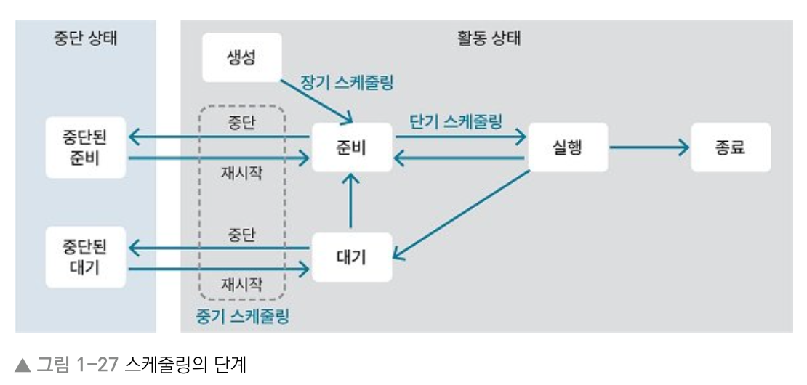
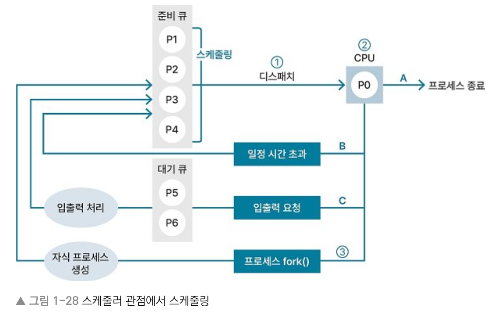
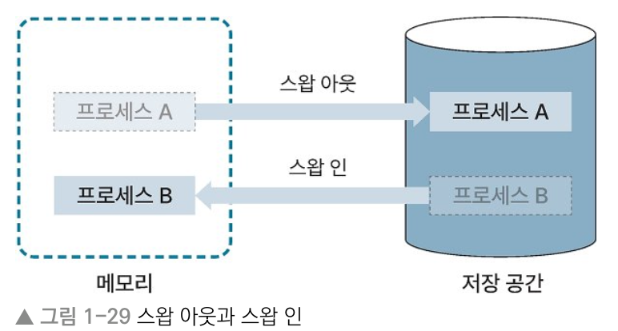

# 1장 운영체제
## 1.3 스케줄링
> Keyword : 스케줄링, 장기/중기/단기 스케줄링, 스왑 아웃, 스왑 인, 비선점형 스케줄링(FCFS, SJF, HRRN) , 선점형 스케줄링(RR, SRTF, 멀티 레벨)

### OS와 스케줄링
- 멀티프로세스 환경에서는 여러 프로세스가 모두 실행되어야 하지만, CPU 자원은 한정적
- 따라서 스케줄링을 통해 모든 프로세스를 공평하게 실행해서 한정된 자원을 효율적으로 활용하는 것이 OS의 주요 목적

### 스케줄링의 목적
- 멀티 프로세스 환경에서 모든 프로세스를 공평하게 실행하는 것

#### 세부목적
- 공평성 : 모든 프로세스가 공평하게 실행. 특정 프로세스가 실행되지 않는 경우가 없도록 스케줄링해야 함.
- 효율성 : 자원을 효율적으로 사용해서 자원이 사용되지 않는 시간이 없도록 스케줄링
- 안정성 : 우선순위를 고려해 높은 우선순위의 프로세스를 먼저 처리하도록 스케줄링
- 반응 시간 보장 : 프로세스가 오랜 시간 응답이 없으면 사용자는 시스템이 멈춘 것으로 보므로 일정 시간 내에 응답할 수 있게 스케줄링
- 무한 연기 방지 : 특정 프로세스에 대한 처리가 무한히 연기되지 않도록 스케줄링

### 스케줄링의 단계
#### 장기 스케줄링
- 준비 큐에 어떤 프로세스를 넣을지 결정해 메모리에 올라가는 프로세스 수 조절.
- 잡 스케줄링 또는 승인 스케줄링 이라고도 함.
- 현재 OS에서는 시분할 시스템을 사용해서 대부분 사용 안함.

#### 중기 스케줄링
- 메모리에 로드된 프로세스 수를 동적으로 조절
- 메모리에 프로세스가 많이 로드되면 스왑 아웃해서 일부 프로세스를 통째로 저장
- 스왑 아웃된 프로세스는 중단 상태가 됨
- 중단상태는 준비상태에서 스왑 아웃된 '중단된 준비 상태'와 대기 상태에서 스왑 아웃된 '중단된 대기 상태'로 구분

#### 단기 스케줄링
- 준비 큐에 있는 대기 상태 프로세스 중 어떤 프로세스를 다음으로 실행할지 스케줄링 알고리즘으로 결정
- 어떤 프로세스를 디스패치할지 결정하는데, CPU 스케줄링 이라고도 함

#### 스케줄링의 단계 - 스케줄링이 일어나는 시점

#### 스케줄러 관점에서 프로세스 스케줄링

1. 스케줄러가 준비 큐에 있는 프로세스 중 하나를 CPU에 디스패치. 이 때 스케줄링 알고리즘 이용.
2. CPU에서 프로세스 실행. 이때 프로세스는 실행 상태
- (A) 프로세스 수행 완료되면 프로레스 종료함
- (B) 일정 시간 초과하면 인터럽트 발생해 프로세스가 준비 큐로 들어가고 준비상태 됨
- (C) 입출력 요청 들어오면 인터럽트 발생. 프로세스는 대기 큐로 들어가서 대기 상태 됨. 입출력 완료 시 프로세스는 준비 큐로 들어감.
3. fork()가 호출되면 자식 프로세스가 생성되고, 자식 프로세스는 준비 큐로 들어감.

#### 스와핑
- 스왑 아웃(swap out) : 프로세스가 실행되려면 메모리에 로드되어야 함. 메모리 공간보다 많은 프로세스 로드되는 경우 있음. 이럴 때 중기 스케줄러가 이벤트 발생을 기다리고 있는 프로세스 통째로 저장 공간(SSD 같은 영역)으로 옮겨 저장하는 것
- 스왑 인(swap in) : 스왑 아웃한 프로세스에서 이벤트 요청이 오면 해당 프로세스를 통째로 다시 메모리에 로드
- 스와핑 (swapping) : 스왑 아웃과 스왑 인처럼 프로세스를 통째로 메모리 영역과 저장 공간으로 옮기는 것. 메모리 공간보다 많은 프로세스를 실행할 수 있는 게 장점.

### 스케줄링 알고리즘
- CPU 스케줄러(단기 스케줄러)가 준비 큐에 있는 프로세스 중 어떤 프로세스를 실행시킬지 결정하는 데 사용

#### 스케줄링 알고리즘 평가 기준
- CPU 사용률 : CPU를 놀리지 않고 사용하는지 판단
- 처리량 : 단위 시간 당 실행한 프로세스 수
- 응답 시간 : 프로세스에 요청 발생했을 때 응답까지 걸리는 시간
- 반환 시간 : 프로세스가 로드된 이후부터 종료될 때까지 걸리는 시간
- 대기 시간 : 프로세스가 대기 큐에서 대기하는 시간의 총합 

#### 비선점형 스케줄링
- 실행 중인 프로세스가 종료될 때까지 다른 프로세스를 실행할 수 없음
- FCFS(First Come First Served) 스케줄링 : 준비 큐에 먼저 들어온 프로세스를 먼저 실행
- SJF(Shortest Job First) 스케줄링 : SJN(Shortest Job Next)라고도 함. 준비 큐에 있는 프로세스 중 CPU를 점유하는 실행 시간이 가장 짧은 프로세스부터 실행. 
  - 장점 : 평균 대기 시간 짧음 / 단점 : 실행 시간 긴 프로세스는 기아 상태 될 수 있음.
- HRRN(Highest Response Ratio Next) 스케줄링 

#### 선점형 스케줄링
- 스케줄러가 실행 중인 프로세스를 중단시키고 다른 프로세스를 실행할 수 있음
- RR(Round Robin) : 프로세스 간 우선 순위 없음. 모든 프로세스를 순서대로 일정 시간 동안 실행. 일정 시간 초과 시 다른 프로세스 실행. 이 때 일정 시간은 '시간 단위', 타임 퀀텀 혹은 타임 슬라이스라고 함. 
  - 단점 : 콘텍스트 스위칭이 빈번하게 일어나서 오버헤드가 크다
  - 장점 : 모든 프로세스가 반복 수행되어 응답 속도 빠르다
- SRTF(Shortest Remaining Time First) 스케줄링 : 한 프로세스가 실행 중일 때 실행 시간이 더 짧은 프로세스가 준비 큐에 들어오면 더 짧은 프로세스가 CPU 차지.
  - 단점 : 수행 시간이 긴 프로세스는 기아 상태 되기 쉬움
  - 장점 : 평균 대기 시간 짧다
- 멀티 레벨(multi level) 스케줄링 : 준비 큐를 목적에 따라 여러 개로 분리해 사용. 분리한 큐는 각각 우선순위가 있고 각자 다른 스케줄링 알고리즘 적용 가능.
  - foreground 큐 : 응답 속도가 중요한 프로세스가 들어감
  - background 큐 : 응답 속도보다 성능을 중요시하는 프로세스 들어감

### 스케줄링 예제
- 평균 대기 시간 : 각 프로세스 대기 시간 합 / 프로세스 수
- 프로세스가 중간에 중단된 경우에는 수행 완료까지의 대기 시간을 합하면 됨
- RR 스케줄링에서 어떤 프로세스에서 응답 요청이 들어왔을 때 기다리는 최대 시간 : {(전체 프로레스 수) - 1} * (시간단위)
- RR 스케줄링은 콘텍스트 스위칭이 빈번하게 일어나서 시간 단위를 적절하게 설정하는 게 중요
- 평균 대기 시간 기준 : FCFS > SJF > RR, SRTF

## 1.4 메모리 관리 전략
## 1.5 가상 메모리
## 1.6 캐시 메모리
