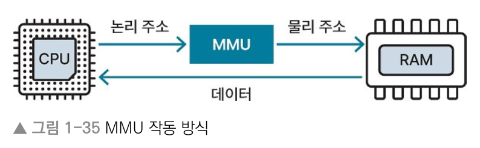
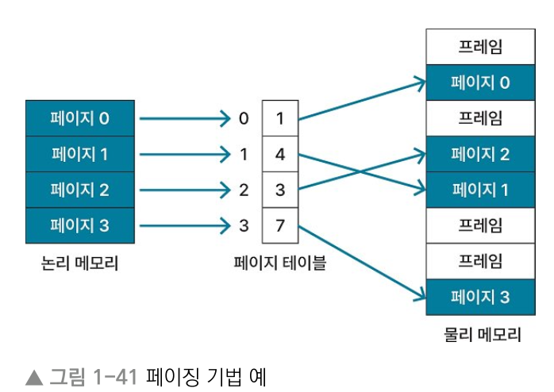
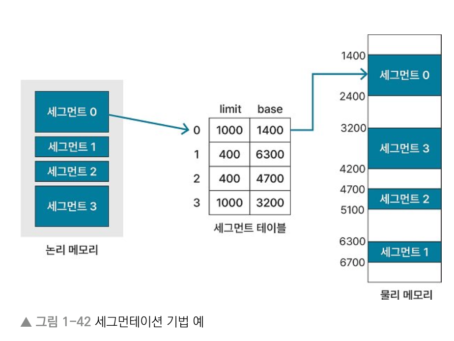

# 1장 운영체제
## 1.4 메모리 관리 전략
> Keyword : 논리 메모리, 물리 메모리, MMU, 연속 메모리 할당(고정분할 - 단편화 / 가변 분할 - 최초, 최적, 최악 적합), 비연속 메모리 할당(페이징, 세그먼테이션)

- 다수의 프로세스를 실행하려면 한정된 메모리 공간에 많은 프로세스를 로드할 수 있어야 함.
- 메모리 공간을 더 효율적으로 활용할 필요 있음

### 논리 메모리와 물리 메모리
#### 논리 메모리 영역, 물리 메모리 영역, 논리 주소, 물리 주소
- CPU가 프로세스를 처리할 때 보는 주소 값과 실제 메모리의 주소 값은 다르다
- 논리 메모리 영역(가상 메모리 영역) : 프로세스가 보는 메모리 영역
- 물리 메모리 영역 : 실제로 사용되는 메모리 영역(RAM)
- 논리 주소(가상 주소) : CPU가 프로세스를 실행하며 보는 주소 값
- 물리 주소 : 실제 메로리에서 사용되는 주소

#### 메모리 관리 장치(MMU, Memory Management Unit)
- CPU가 프로세스를 실행할 때 사용하는 주소 값과 실제 주소 값이 달라서 논리 주소를 물리 주소로 변환해줘야 함.
- 논리 주소에서 물리 주소로 변환하는 동작을 하는 하드웨어 장치
- CPU에 위치하며, CPU에서 메모리로 접근하기 전에 MMU를 거치 논리 주소에 해당하는 물리 주소를 얻는다
- MMU는 보호해야 하는 메모리 영역에 대한 접근을 제한해 메모리를 보호하는 역할
  

### 연속 메모리 할당 (contiguous allocation)
- 멀티 프로세스 환경에서 여러 프로세스를 메모리에 연속적으로 로드하는 방법

#### 고정 분할 방식
- 메모리 영역을 분할한 뒤 각 영역에 프로세스를 할당하는 방식
- 분할된 영역의 크기는 서로 다를 수 있고, 분할된 크기는 고정됨
- 단점 : 메모리에 올릴 수 있는 프로세스 수와 각 프로세스 크기가 제한됨, 단편화 문제

#### 단편화 (fragmentation)
- 외부 단편화 : 메모리 공간을 합치면 공간 할당이 가능한데, 고정 분할 때문에 못하는 경우
- 내부 단편화 : 분할된 크기보다 작은 프로세스가 할당되어 메모리 공간이 남는 경우
  

#### 메모리 압축
- 외부 단편화 문제를 해결하는 방법
- 프로세스가 사용 중인 메모리 공간을 재배치해서 흩어져 있는 가용 메모리 공간을 하나로 합치는 것
- 메모리 집약이라고도 함

#### 가변 분할 방식
- 할당할 프로세스의 크기에 따라 메모리 공간을 분할
- 메모리 할당 알고리즘으로 가용 메모리 공간에서 프로세스가 로드될 수 있는 메모리 공간 찾음

#### 메모리 할당 알고리즘
1. 최초 적합(first-fit) : 가용 메로리 공간에서 프로세스 크기만큼 비어 있는 메모리 공간 찾아서 차례대로 프로세스 로드하는 방식
2. 최적 적합(best-fit) : 할당하려는 프로세스 크기 이상인 가용 메모리 공간 중에서 가장 작은 공간에 프로세스 할당. 가용 메모리 공간 모두 탐색해야 함.
3. 최악 적합(worst-fit) : 할당하려는 프로세스 크기보다 큰 가용 메모리 공간 중에서 가장 큰 공간에 프로세스 할당. 가용 메모리 공간 모두 탐색해야 함.

### 비연속 메모리 할당
- 프로세스의 메모리 영역을 나눠서 메모리 공간에 저장하는 방법

#### 페이징
- 프로세스의 논리 메모리 영역과 물리 메모리 영역을 각각 일정한 크기의 페이지와 프레임으로 나눔
- 이 때 페이지와 프레임 크기는 동일
- 페이지와 프레임에는 각각 번호를 할당해서 프로세스의 페이지와 메모리의 프레임을 매핑
- 장점 : 페이지를 물리 메모리에 연속으로 할당할 필요가 없어서 외부 단편화 문제 해결 가능
- 단점 : 프로세스 크기가 페이지 수로 나누어 떨어지는지는 보장하지 않음.
- 프로세스의 마지막 페이지가 페이지 크기보다 작을 수 있어서 내부 단편화 문제 발생 가능.
- 페이지 테이블 저장 위한 메모리 공간 추가 필요
  

#### 페이지 테이블
- 페이지와 프레임을 매핑. 
- 프로세스의 페이지 정보와 페이지에 매핑하는 프레임의 주소값 저장. 
- 페이지 테이블은 각 프로세스의 PCB에 저장됨

#### 페이징 기법
- 계층적 페이징(멀티 레벨 페이징) : 페이지 테이블을 다시 페이지로 나눠 페이지 테이블 자체를 페이징하는 방식
- 해시 페이지 테이블 : 해시 테이블의 각 항목에 저장된 연결 리스트에 페이지 번호를 해싱한 뒤에 첫번째 요소와 가상 페이지 번호를 비교
- 역 페이지 테이블 : 프레임을 이용해 페이지 찾는 방식, 페이지로 프레임을 찾는 기존 방식과 반대

#### 세그먼테이션
- 프로세스의 메모리 영역을 논리적 단위인 세그먼트로 분할해 메모리를 할당
- 논리적 단위는 파일 내 함수 단위나 프로세스의 스택, 힙 같은 영역 의미하기도 함

#### 세그먼테이션 테이블
- 세그먼트의 논리 주소를 물리 주소로 매핑
- 세그먼트 테이블은 세그먼트 번호를 인덱스로 사용하고, 세그먼트별 시작 주소인 base와 세그먼트 길이인 limit 저장
- 장점 : 프로세스의 메모리 영역을 논리적 단위로 나눠 저장하므로 단위별로 데이터를 보호하기 쉽다
- 단점 : 세그먼트 크기가 균등하지 않아서 프로세스의 할당/해제를 반복하는 과정에서 외부 단편화 문제 발생 가능
- 단점 : 메모리에 로드된 스택 세그먼트 영역에서 오버플로 발생 시 다른 프로세스와 메모리 영역이 겹칠 수 있다.
- 그러면 다른 프로세스의 세그먼트나 스택 오버플로가 발생한 세그먼트를 디스크로 스왑 아웃 해야 함.

## 1.5 가상 메모리
## 1.6 캐시 메모리
