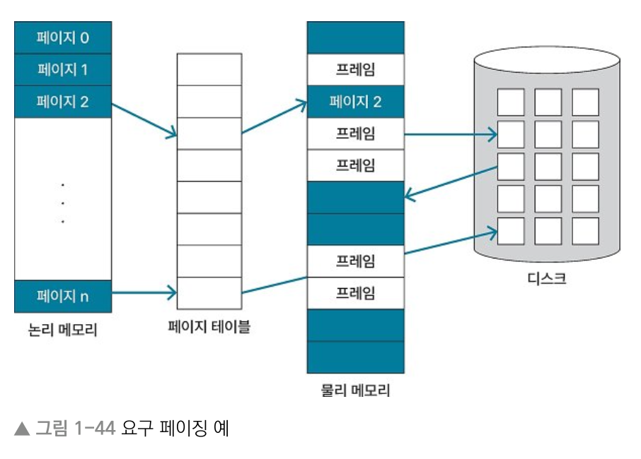
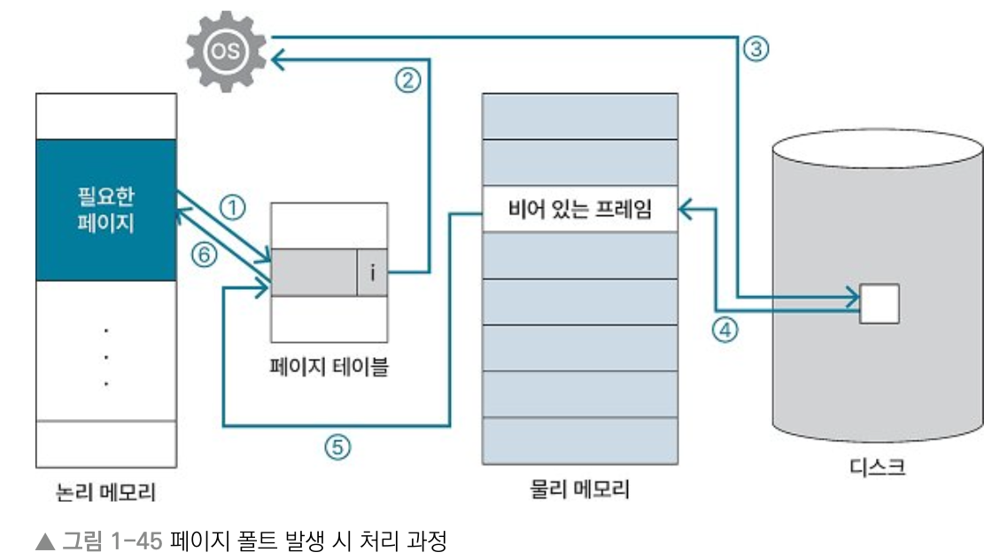

# 1장 운영체제

## 1.5 가상 메모리
> Keyword : 가상 메모리, 요구 페이징, 페이지 폴트, 스레싱, 워킹 세트

### 가상 메모리란 
- 사용자가 프로그램 실행하면 OS는 디스크에 저장된 데이터를 메모리로 로드
- 하지만 메모리 공간은 한정되어 있고, 사용자는 동시에 많은 프로그램 실행 원함.
- 메모리 공간의 한계를 극복하기 위해 가상메모리 등장

#### 가상 메모리
- 프로세스의 일부만 메모리에 로드하고, 나머지는 디스크에 둔 상태로 프로세스를 실행하는 방식
- 프로세스 전체가 메모리에 올라오지 않아도 프로세스 실행에 문제 없다는 점에서 착안
- 사용자에게는 프로세스 전체가 메모리에 로드된 것처럼 보이지만, 실제로는 아니어서 가상메모리

#### 가상 메모리 장점
- 프로그램이 메모리 크기에 대한 제약 덜 받을 수 있다
- 동시에 많은 프로그램을 실행해서 CPU 이용률과 처리율 높일 수 있다
- 필요한 영역만 메모리에 로드해 스와핑 횟수를 줄여서 프로그램 실행 속도를 높일 수 있다

### 요구 페이징
#### 요구 페이징 (demand paging)
- 프로세스에서 필요한 페이지만 메모리에 로드하는 방식
- 페이지를 모두 메모리에 로드하지 않고 초기에 필요한 영역만 로드한 후 다른 영역은 요청이 올 때 메모리에 로드
- 필요한 페이지를 물리 메모리에 로드하고 필요하지 않은 페이지는 디스크에 저장
  

#### 페이지 폴트 (page fault)
- 프로그램을 실행하다가 물리 메모리에 필요한 페이지 없을 때
- 발생 시 디스크에서 필요한 페이지 스왑 인. 
- 이 때 페이지에 해당하는 메모리 영역에 물리 메모리에 있는지는 페이지 테이블로 파악가능
- 페이지 테이블은 페이지에 해당하는 프레임이 존재하면 'v(valid)', 프레임이 존재하지 않거나 유효하지 않은 주소 값이면 'i(invalid)' 값 반환

#### 페이지 폴트 발생 시 처리 과정
  
1. 페이지가 물리 메모리에 있는지를 페이지 테이블에서 확인. 페이지 폴트 발생 시 i 반환.
2. i 반환시 OS는 참조하려는 페이지 주소 값이 유효하지 않은건지 메모리에 로드되지 않은 영역인지 판단
3. 필요한 페이지가 메모리에 로드되지 않은 영역이면 디스크에서 해당 영역 찾음
4. 디스크에서 해당 페이지 영역 스왑 인. 이 때 물리 메모리에 비어 있는 프레임 있으면 페이지를 해당 영역에 바로 로드. 없으면 페이지 교체 알고리즘 호출해서 기존 로드된 페이지를 디스크로 스왑 아웃하고 새로운 페이지 로드.
5. 페이지 테이블에서 새로 로드한 페이지 값 v로 변경
6. 프로세스 다시 실행

### 스레싱 (thrashing)
- 동시에 일정 수 이상의 프로그램을 실행했을 때 오히려 CPU 이용률이 떨어지는 상황
- 가상 메모리를 구현해서 다중 프로그래밍을 하면 CPU 이용률 높아짐
- 일정 수 이상으로 다중 프로그래밍 하면 페이지 폴트 자주 일어남
- 따라서 디스크 영역에서 필요한 페이지를 스왑 인하고 불필요한 페이지 스왑 아웃하는 작업도 자주 일어남.
- 다중 프로그래밍 정도가 높아지면 페이징이 빈번히 일어나고 실질적으로 CPU 이용률 떨어지는 스레싱 발생

#### 워킹 세트
- 지역성을 기반으로 자주 사용하는 페이지 저장해 두는 것
- 스레싱 예방
- 워킹 세트를 바탕으로 자주 사용하는 페이지를 물리 메모리의 프레임에 고정하면 페이지 폴트가 빈번하게 발생하는 현상 방지 가능

## 1.6 캐시 메모리
