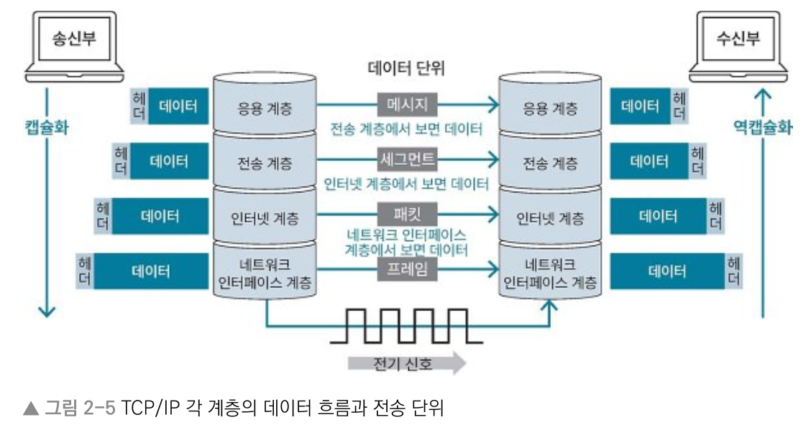

# 2장 컴퓨터 네트워크
## 2.1 네트워크 계층
> Keyword : OSI 7계층(응용-표현-세션-전송-네트워크-데이터링크-물리), TCP/IP 4계층(응용-전송-인터넷-네트워크인터페이스), 캡슐화, 

### 네트워크 계층
- 네트워크에는 다양한 기기 간 통신을 위한 약속된 구조 있음
- 네트워크를 개념적으로 나눈 OSI 7계층
- 실제 인터넷 통신에 사용되는 TCP/IP 4계층

### OSI 7계층
- 네트워크 통신이 이뤄지는 과정을 7단계로 나눈 네트워크 표준 모델
- 데이터를 송신할 때는 높은 계층에서 낮은 계층으로 전달한다
- 데이터가 수신부의 가장 낮은 계층에 도달하면 수신부에서는 낮은 계층에서 높은 계층으로 데이터 전달

#### 데이터 캡슐화
- 각 계층은 독립적이고 데이터를 송신할 때 각 계층에서 필요한 정보를 추가해 데이터 가공
- 이 과정에서 제어 정보를 담은 헤더나 트레일러가 붙음. 
- 수신부의 같은 계층에서 데이터 호환성을 높이고 오류의 영향을 최소화하기 위함
- 헤더는 데이터 앞 / 트레일러는 데이터 뒤
  

#### 역캡슐화
- 송신부에서 데이터 캡슐화를 거친 결과물을 수신부로 보냄. 
- 수신부는 물리~응용 계층까지 거치며 받은 데이터에서 헤더와 트레일러를 분석해 제거하는 역캡슐화 진행
- 이 과정에서 각 계층은 필요한 제어 정보 얻음

#### 프로토콜
- 통신규약
- 데이터를 송수신하기 위해 정한 규칙

#### OSI 7계층
- 7계층 (응용) : HTTP, FTP 등의 프로토콜을 응용 프로그램의 UI를 통해 제공
- 6계층 (표현) : 데이터를 표준화된 형식으로 변경
- 5계층 (세션) : 세션의 유지 및 해제 등 응용 프로그램 간 통신 제어와 동기화
- 4계층 (전송) : 신뢰성 있는 데이터를 전달하기 위한 계층. TCP, UDP 같은 전송방식과 포트 번호 등을 결정.
- 3계층 (네트워크) : 데이터를 송신부에서 수신부까지 보내기 위한 최적 경로를 선택하는 라우팅 수행. 선택한 최적 경로가 라우트. 네트워크 계층 장비로는 라우터가 있음.
- 2계층 (데이터 링크) : 데이터 흐름을 관리하며 데이터의 오류 검출 및 복구 등 수행. 브리지, 스위치, 이더넷 등이 이 계층의 장비
- 1계층 (물리) : 데이터를 비트 단위와 0과 1로 변환한 후 장비를 사용해 전송하거나 전기 신호를 데이터로 복원. 리피터, 허브 등이 이 계층에 해당하는 장비
  

### TCP/IP 4계층
- 인터넷에서 데이터를 주고받기 위한 네트워크 프로토콜
- TCP/IP에 맞춰 네트워크 통신 표준인 OSI 7계층을 단순화한 것
- TCP (Transmission Control Protocol) : 데이터를 나눈 단위인 패킷의 전달 여부와 전송 순서를 보장하는 통신 방식
- IP (Internet Protocol) : 패킷을 빠르게 보내기 위한 통신 방식
- HTTP : 대표적인 TCP/IP 기반 프로토콜
  

#### TCP/IP 4계층
- 4계층 (응용) : 사용자와 소프트웨어를 연결해주는 계층. HTTP, HTTPS, DNS 등의 프로토콜이 작동함.
- 3계층 (전송) : 데이터의 신뢰성 보장. 포트 번호로 데이터를 적절한 응용프로그램에 전달하는 역할. TCP, UDP 등의 프로토콜이 전송계층. 세그먼트.
- 2계층 (인터넷) : 데이터를 최종 목적지까지 도달할 수 있게 하는 계층. IP가 대표적 프로토콜. 전송 계층으로부터 받은 데이터에 헤더를 붙여 캡슐화. 이를 패킷 또는 데이터그램이라 함.
- 1계층 (네트워크 인터페이스) : 네트워크 접근 계층이라고도 함. 데이터를 전기 신호로 변환하고 MAC 주소를 사용해 기기에 데이터 전달. 이더넷, Wi-Fi 등이 대표적 프로토콜.
  

#### 용어
- 패킷 : 네트워크에서 주고 받는 데이터를 작게 분할한 단위. 데이터의 송신주소, 수신 주소 등 정보 포함되어 데이터를 목적지에 제대로 전달할 수 있게 함.
- MAC 주소 (Media Access Control address) : 48비트로 구성된 하드웨어 고유의 주소. 네트워크인터페이스 계층에서 사용함.
- IP 주소 : IP에서 컴퓨터 또는 네트워크 장치 식별을 위한 값. 네트워크부와 호스트부로 나뉨.
  - 네트워크부 : 해당 주소가 어떤 네트워크에 속해있는지 구분하는 값
  - 호스트부 : 해당 네트워크에서 어떤 기기인지를 나타내는 값
  - IPv4 : 주소값은 xxx.xxx.xxx.xxx 형태. 8자리 2진수 4개를 10진수로 표현한 것.
- 서브넷 마스크 : IP와 동일한 구조인 8자리 2진수 4개로 구성. 연속적인 1과 0으로 되어서 IP주소와 and 연산 시 IP주소에서 네트워크부와 호스트부 알아낼 수 있음.
  
  

## 2.2 TCP와 UDP
## 2.3 HTTP
## 2.4 REST