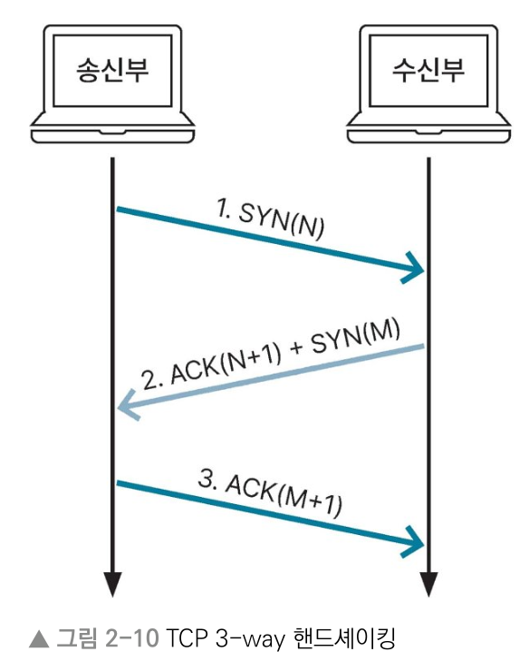
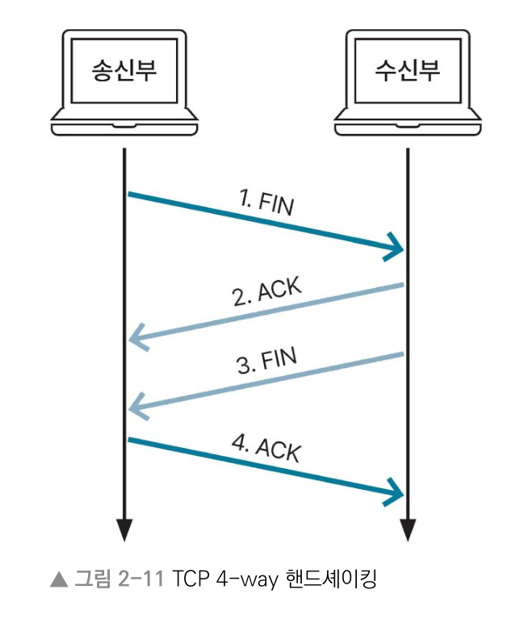
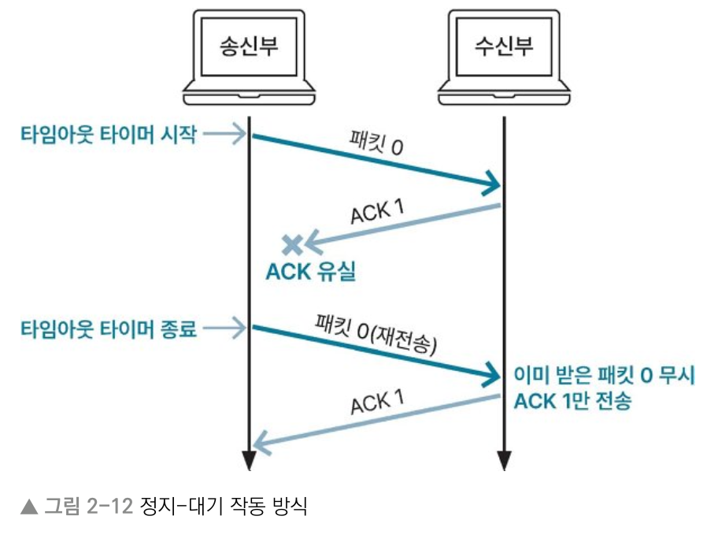
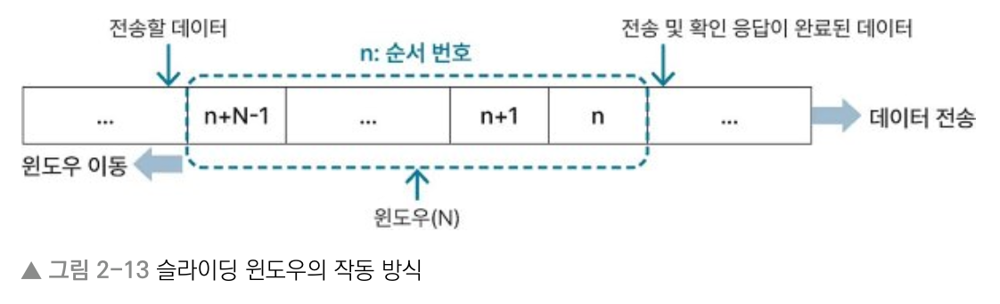
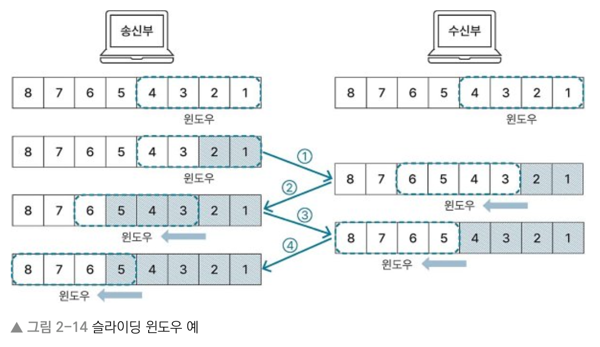
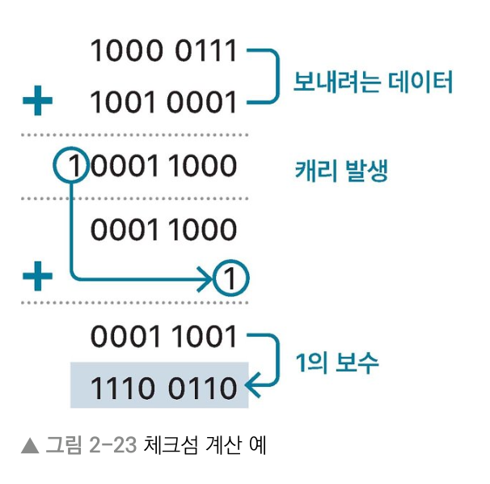

# 2장 컴퓨터 네트워크
## 2.2 TCP와 UDP
> Keyword : TCP, TCP 핸드셰이킹, 패킷 교환 방식 (가상회선/데이터그램), 플래그(SYN, FIN, ACK), TCP 제어 방법(흐름(정지-대기, 슬라이딩 윈도우), 혼잡(AIMD, 느린 시작, 혼잡 회피, 빠른 회복, 빠른 재전송), 오류(정지-대기, Go-Back-N ARQ, Selective-Repeat ARQ))
> Keyword : UDP, 체크섬

### TCP란
- 전송 계층에 해당하는 네트워크 프로토콜
- 연결형 서비스를 지원하고 데이터의 신뢰성을 보장

### TCP의 특징
- 송신부와 수신부의 연결을 확인하는 연결형 서비스
- 패킷 교환 방식은 패킷이 전달되는 회선이 정해져있는 가상 회선 방식
- 패킷의 전송 순서 보장
- 패킷의 수신 여부 확인
- 송신부와 수신부는 1:1 통신 함
- 데이터 손실 없음을 보장해서 신뢰성 높음
- 데이터의 송수신 속도 느림

#### 패킷 교환 방식
- 가장 많이 사용하는 데이터 통신 방식. 가상 회선방식과 데이터그램 방식 있음.
- 가상회선방식 : 데이터를 주고 받기 전에 패킷을 전송할 경로인 가상 회선을 설정해서 모든 패킷을 같은 경로로 전송
- 데이터그램 방식 : 패킷마다 최적의 경로로 전송되는 방식. 송신부에서 보낸 패킷의 순서와 수신부에 도착하는 패킷의 순서 다를 수 있음.

### TCP 핸드셰이킹
- TCP에서는 연결형 서비스를 지원하기 위해 송신부와 수신부를 연결하는 과정 거침
- 연결시작: 3-way 핸드셰이킹 / 연결종료: 4-way 핸드셰이킹
- 핸드셰이킹 과정에서는 송신부와 수신부 간 연결을 제어 및 관리하도록 플래그 값 주고 받음.

#### 플래그 (flag)
- SYN : Synchronization(동기화). 연결 생성 시 사용.
- FIN : Finish(종료). 연결 끊을 때 사용
- ACK : Acknowledgment(승인). 데이터를 전송하면 수신자가 받았음을 알려줄 때 사용
- RST : Reset(초기화). 연결 재설정 시 사용
- PSH : Push(밀다). 빠른 응답이 필요한 데이터를 응용 계층으로 즉시 전송할 때 사용
- URG : Urgent(긴급). 다른 데이터보다 우선순위가 높은 데이터를 전송할 때 사용

#### 3-way 핸드셰이킹
- 데이터를 본격적으로 주고받기 전 상대방 컴퓨터와 세션을 수립하는 과정
- 요청과 응답을 총 3번 주고 받음
- 송신부와 수신부 간에 번갈아 요청과 응답을 해서 연결 확인 후에 본격적인 데이터 통신 하게 됨.
  

1. 송신부가 수신부와 연결하기 위해 SYN 메시지 보냄. 이 때 임의의 숫자 N을 같이 보냄. 
- 송신부는 수신부로부터 응답오기 전까지 SYN_SENT 상태.
2. 수신부가 송신부로부터 SYN 메시지 받으면 연결 요청 수락하는 의미인 ACK 메시지 전송.
- ACK 메시지에는 송신부로부터 받은 N에 1을 더한 N+1 값 같이 보냄.
- 수신부에서도 송신부와의 연결을 확인하기 위해 SYN 메시지에 임의의 숫자인 M 보낸 후, 송신부 응답 기다림.
- 수신부는 SYN_RECEIVED 상태
3. 송신부가 수신부로부터 ACK + SYN 메시지를 받으면 연결이 성립되었따는 의미인 established 상태가 됨.
- 메시지 대한 응답으로 ACK 메시지와 M+1 값 같이 보냄.
- 이 때 ACK 메시지에는 송신부에서 전송하려는 데이터 포함될 수 있음.
- 송신부로부터 ACK 메시지 받으면 수신부는 established 상태 됨.

#### 4-way 핸드셰이킹
- TCP 연결을 해제할 때 이뤄지는 과정
- 요청과 응답을 총 4번 주고받음
  

1. 송신부가 수신부와 연결 종료하려고 FIN 메시지 보냄. 송신부는 FIN_WAIT1 상태.
2. 수신부가 FIN 받으면 응답으로 ACK 메시지 보냄. 수신부는 CLOSE_WAIT 상태.
- 수신부는 메시지 보낸 후 앱 종료하는 등 연결 종료하기 위한 작업 함.
- 송신부에서는 수신부에서 보낸 ACK 메시지 받고 FIN_WAIT2 상태 됨.
3. 수신부에서 연결 종료 준비 끝나면 송신부에 FIN 메시지 보내고 LAST_WAIT 상태됨.
4. 송신부는 서버로부터 받은 FIN 메시지에 응답하기 위해 ACK 메시지 보내고 TIME_WAIT 상태.
- 일정 시간 지나면 CLOSED 상태됨. 
- 일정 시간 TIME_WAIT 상태 유지하는 이유는 FIN 메시지 전에 보낸 패킷이 FIN 메시지 수신보다 지연되어 발생하는 패킷 유실에 대비하기 위함
- 수신부에 ACK 메시지가 제대로 전달되지 않아 연결 해제 이뤄지는 경우도 많음
- 수신부는 송신부로부터 ACK 메시지 받고 CLOSED 상태됨.

### TCP 제어 방법
- TCP의 데이터 신뢰성을 보장하기 위한 제어 방법
- 흐름 제어 / 혼잡 제어 / 오류 제어 

### 흐름 제어 (flow control)
- 데이터 송신부와 수신부에서 데이터 처리 속도의 차이 때문에 생기는 데이터 손실을 방지하는 방법
- 정지-대기, 슬라이딩 윈도우
#### 정지-대기(stop-wait)
- 송신부에서 데이터 보낸 후 수신부로부터 ACK 메시지 받을 때까지 다음 데이터 보내지 않고 기다리는 방식

#### 슬라이딩 윈도우(sliding window)
- 송신부에서 ACK 확인하지 않고 수신부에서 설정한 윈도우 크기만큼 데이터를 연속적으로 보낼 수 있게 해서 데이터 흐름을 동적으로 제어

### 혼잡 제어 (congestion control)
- 송신부의 데이터 전달 속도와 네트워크 속도 차이로 데이터 손실이 발생하는 것을 방지하기 위한 방법
- AIMD, 느린 시작, 혼잡 회피, 빠른 회복, 빠른 재전송

#### AIMD(Additive Increase Multiplicative Decrease)
- 데이터 전달 시 합 증가의 방식으로 혼잡 윈도우의 크기를 더해가면서 키움
- 데이터 손실 발생 시 혼잡 윈도우의 크기를 곱 감소 방식을 적용해 1/2배와 같이 배수 단위로 줄임
- 장 : 시간이 지나면 여러 송신부 간에 네트워크 대역폭을 공평하게 사용할 수 있게 됨.
- 단 : 데이터 유실 발생 시 윈도우 크기 증가폭 대비 감소폭이 커서 네트워크 대역폭을 넓게 사용하기까지 시간 오래 걸림

#### 느린 시작(slow start)
- 윈도우 크기가 1인 상태에서 시작해 ACK 메시지 수신할 때마다 1씩 크기 늘려감.
- 혼잡 발생 시 윈도우 크기를 1로 확 줄임
- 보낼 수 있는 패킷 수가 지수 함수 형태로 증가 (1 -> 2 -> 4..)
- 장 : 전송 가능한 패킷 수(윈도우 크기)를 지수 함수 형태로 늘리는 점
- AIMD 방식에서 초기에 전송 가능한 패킷 수가 적다는 단점 보완

#### 혼잡 회피(congestion avoidance)
- 윈도우 크기가 지수 함수 형태로 증가하다가 혼잡이 발생하는 것을 방지하기 위해 윈도우 크기에 대한 임계점 정하는 방식
- 윈도우 크기가 threshold(임게점)에 도달하면 윈도우 크기를 선형적으로 증가하게 한다
- ACK 메시지를 받지 못해 타임아웃 발생 시 발생시점에서 윈도우 크기의 절반을 임계점으로 설정하고 윈도우 크기를 초깃값으로 변경

#### 빠른 회복(fast recovery)
- 혼잡 발생 시 혼잡 윈도우 크기를 절반으로 줄인 후 선형적으로 증가하는 방식
- 즉, 혼잡이 처음 발생하면 AIMD 방식으로 동작

#### 빠른 재전송(fast retransmit)
- Duplicate ACK 3번 발생 시 해당 시점의 윈도우 크기를 1/2로 줄임
- 그 뒤로 ACK 메시지 받으면 다시 윈도우 크기를 키운다
- Duplicate ACK은 패킷이 순서대로 도착하지 않아서 받아야 할 차례의 패킷을 ACK 메시지와 함께 요청하는 것을 뜻함
- 3 Duplicate ACK 발생 시 혼잡이 발생했다고 판단해 윈도우 크기 조정 

#### TCP 혼잡 제어 정책
- TCP는 혼잡 제어 방식을 여럿 혼합하는 혼합제어 정책 사용.
- TCP Tahoe, TCP Reno, New Reno, Cubic 등 다양한 혼잡제어 정책
- 대표적인 방식인 TCP Tahoe, TCP Reno 모두 느린 시작 방식 사용하다가 임계점 넘어가면서 AIMD 방식으로 전환
- 이 때 임계점은 느림 시작 방식의 임계점을 의미해서 ssthresh(slow start threshold)라 함

### 오류 제어 (error control)
- 통신 중 데이터에 오류 또는 유실이 발생할 때 데이터의 신뢰성을 보장하기 위해 오류를 제어하는 방식
- 정지-대기, Go-Back-N ARQ, Selective-Repeat ARQ

#### 데이터에 오류 또는 유실 발생 인지하는 경우
1. 수신부에서 잘못된 데이터를 받았다는 응답인 NAK(Negative Acknowledge) 메시지 보냈을 때
2. 3 Duplicate Ack 발생
3. 수신부로부터 ACK 메시지를 받지 못해 타임아웃 발생

#### 정지-대기
- 송신한 패킷에 대한 ACK 메시지를 일정 시간 동안 받지 못해 타임아웃 발생 시 해당 패킷 다시 보냄
- 흐름 제어에서 나왔던 방식인데 데이터 유실 간단 처리 가능해서 오류제어에서도 사용
- 송신부에서 데이터를 1개만 보내고 메시지 기다려야 해서 ARQ 방식 사용됨
- ARQ(Automatic Repeat Request)는 재전송 요청을 의미

#### Go-Back-N ARQ
- 송신부에서 연속적으로 데이터 보냈을 때 누락된 데이터 있으면 송신부에서 해당 데이터부터 재전송

#### Selective-Repeat ARQ
- 송신부에서 연속적으로 데이터 보냈을 때 누락된 데이터 있으면 수신부에서 해당 데이터만 재전송 요청
- 특정 패킷만 재전송하는 건 효율적이지만 받은 패킷을 재정렬하는 로직 추가 필요

### UDP
#### UDP (User Datagram Protocol, 사용자 데이터그램 프로토콜)
- TCP처럼 전송 계층에 해당하는 네트워크 프로토콜
- 송신부와 수신부 간 연결을 지원하지 않고 데이터그램 형태의 통신을 지원
- 핸드셰이킹 과정 없이 패킷 바로 송수신
- 신뢰성 낮지만 속도 빠르다

#### UDP 특징
- 송신부와 수신부 연결이 보장되지 않는 비연결형 서비스
- 패킷이 서로 다른 회선으로 교환될 수 있는 데이터그램 패킷 교환방식
- 송신부에서 전달한 패킷 순서와 수신부에서 받은 패킷 순서 다를 수 있음
- 패킷 수신 여부 미확인
- 1:1, 1:N, N:N 통신 다 가능
- 데이터 신뢰성 낮음
- 데이터 전송 속도 빠름

#### UDP의 오류 검출
- UDP는 최소한의 신뢰성 보장을 위해 체크섬 방식으로 오류 검출 가능
- 체크섬 : 데이터의 무결성 보장하는 간단한 방법. 체크섬 위한 데이터 모두 더하고 오버플로되는 캐리 발생 시 해당 캐리 떼서 데이터 다시 더한 후 1의 보수 취함.
  
- UDP 송신부는 UDP의 헤더, IP 헤더의 일부 정보(발신 IP 주소, 수신 IP 주소, 프로토콜 ID 등)와 데이터로 체크섬 값 생성
- 생성한 체크섬 값을 UDP 헤더의 체크섬 영역에 넣어서 수신부에 보냄
- 수신부는 체크섬을 포함한 모든 값 더해서 비트가 모두 1이 나오는지 확인
- 비트가 모두 1인 것은 송신부와 동일한 체크섬 값이 나온다는 것
- UDP의 체크섬은 선택사항. 0으로 보내면 수신부는 체크섬 계산 안 함.

## 2.3 HTTP
## 2.4 REST