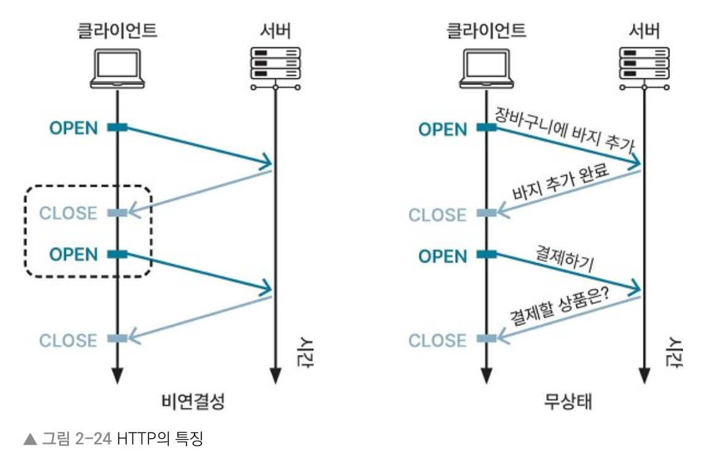
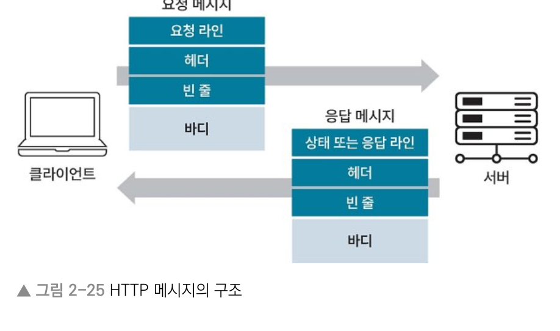
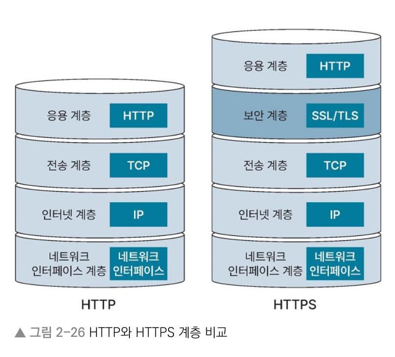
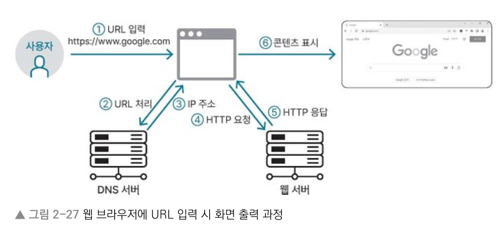

# 2장 컴퓨터 네트워크
## 2.3 HTTP
> Keyword : HTTP(비연결성 - HTTP Keep Alive, 무상태 - 쿠키, 세션), HTTPS

### HTTP (HyperText Transfer Protocol)
- 인터넷상에서 데이터를 전송하기 위한 프로토콜
- TCP/IP 4계층에서 응용 계층에 속함

#### HTTP의 특징
1. 비연결성 (connectionless) : 클라이언트에서 요청 보낸 후 서버로부터 응답 받으면 연결 끊는 것
   - 장 : 불특정 다수를 대상으로 하는 서비스에 유리. 연결 유지 안 해서 자원 아낌.
   - 단 : 서버가 클라이언트 기억할 수 없고, 클라이언트에서 연속적으로 요청 오면 연결과 연결 해제 반복해서 자원 낭비
   - 보완 : 일정 시간 동안 연결 유지할 수 있게 HTTP Keep Alive 사용. 마지막 응답 이후 일정시간 연결 유지할 수 있게 사용하는 HTTP 헤더의 일종.
2. 무상태 (stateless) : 서버에서 클라이언트의 상태를 저장하지 않는 것
   - 클라이언트가 이전에 요청한 사항 서버에 저장하지 않음
   - 쿠키 : 클라이언트는 요청에 필요한 데이터 모두 가지고 있어야 함
   - 세션 : 서버가 클라이언트로부터 받은 요청사항을 모두 저장해야 함
   - 장 : 서버 확장성 높음. 클라이언트 요청에 응답하는 서버 바뀌어도 됨. 특정 서버에 문제 생겨서 응답 못하는 문제점 보완 가능.
     

#### 쿠키와 세션
- 쿠키 : 클라이언트의 로컬 웹 브라우저에 저장하는 데이터 파일. 키와 값 저장. ex) 웹 사이트의 로그인 정보, 온라인 쇼핑몰의 장바구니
- 세션 : 서버에서 클라이언트와의 연결 정보를 저장 및 관리하는 것. 서버에 데이터가 저장되므로 보안면에서는 더 좋지만, 접속자 많으면 서버 과부하 가능.

#### HTTP 메시지
- HTTP에서는 클라이언트와 서버가 통신하기 위해 정형화된 데이터인 HTTP 메시지 주고 받음
  

#### HTTP 메시지의 구조
- 요청 라인 : 요청 URI, 요청 방법, HTTP 버전 등 포함
- 상태 라인 : 요청에 대한 HTTP 상태 코드와 HTTP 버전 포함
- 헤더 : 키-값으로 구성된 다수의 헤더 항목으로 구성
- 빈 줄 : 헤더의 끝을 나타내는 빈 줄로, 헤더와 바디 구분.
- 바디 : 요청할 때 요청 방법 메서드가 POST일 때만 바디가 있고, 그 외는 비어 있는 상태로 전달

#### HTTP 상태 코드
- 1xx : 요청 받아 처리 중 / 2xx : 성공 / 3xx : 추가 처리 필요 / 4xx : 클라이언트 오류 / 5xx : 서버 오류

### HTTPS (HyperText Transfer Protocol Secure)
- 보안 계층인 SSL/TLS를 이용해 HTTP의 보안을 강화한 웹 통신 프로토콜
- 데이터 암호화를 거치지 않고 전송해서 보안에 취약한 HTTP 보완
- SSL (Secure Socket Layer) : 넷스케이프에서 개발한 암호화 프로토콜.
- TLS (Transport Layer Security) : SSL 문제점을 보완. 현재 HTTPS에서 통용되는 방식이지만 명칭이 남아서 SSL 또는 SSL/TLS라 부름.

#### HTTPS 동작 방식
- 데이터 송신할 때 응용 계층에서 보안 계층의 SSL/TLS로 데이터 보내면 데이터를 암호화해 전송 계층으로 전달
- 데이터 수신 시 전송 계층에서 보낸 데이터를 보안 계층의 SSL/TLS 에서 받아 복호화 후 응용 계층으로 보냄
  

#### 대칭 키 암호화 방식과 공개 키 암호화 방식
- SSL/TLS 에서 사용하는 2가지 암호화 방식
- 대칭 키 : 데이터의 암호화와 복호화에 모두 같은 키인 대칭 키 이용. 
  - 수신자가 가진 키를 송신자에게 줌. 수신자가 같더라도 송신자가 다르면 이용하는 키 다름. 
  - 송신자는 받은 키로 암호화한 후 수신자에 보냄. 수신자는 동일한 키로 데이터 복호화.
- 공개 키 : 데이터의 암호화와 복호화를 다른 키로 함.
  - 데이터를 암호화할 때는 공개 키, 데이터 복호화에는 비밀 키 이용. 
  - 수신자는 공개 키를 송신자에게 주는데 송신자가 달라도 공개 키 같음
  - 송신자는 수신자에게 받은 키로 데이터 암호화. 수신자는 비밀 키로 송신자에게 받은 데이터 복호화.

### 웹 페이지 접속 과정

1. 사용자가 URL을 웹 브라우저에 입력
2. 웹 브라우저는 입력한 URL을 바탕으로 DNS 서버에 연결할 IP를 요청
3. DNS 서버는 IP 주소를 웹 브라우저에게 응답으로 제공
4. 웹 브라우저는 DNS 서버에서 받은 IP를 통해 웹 서버와 TCP/IP 연결을 하고 HTTP 요청 보냄
5. 웹 서버는 받은 HTTP 요청에 응답. 응답은 웹 페이지와 필요한 리소스 포함.
6. 웹 브라우저는 받은 응답을 바탕으로 사용자에게 웹 페이지 보여줌.

## 2.4 REST