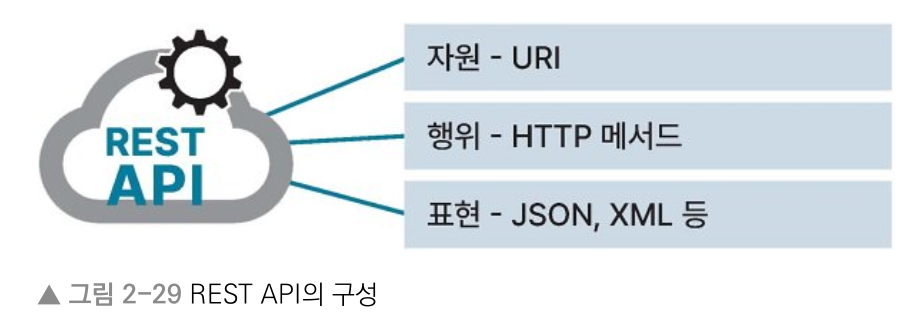
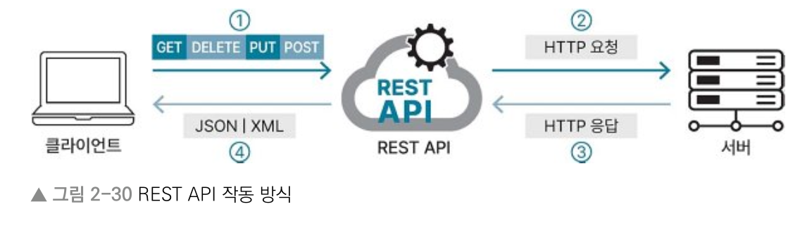
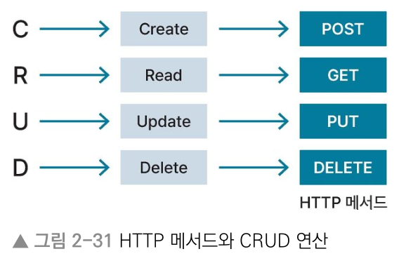

# 2장 컴퓨터 네트워크
## 2.4 REST
> Keyword : HTTP(비연결성 - HTTP Keep Alive, 무상태 - 쿠키, 세션), HTTPS

### REST (Representational State Transfer)
- HTTP 통신을 활용하기 위해 고안된 아키텍처
- Representational은 인터넷상의 자원을, URI(Uniform Resource Identifier)로 나타낼 수 있음을 의미
- 클라이언트는 URI로 표현된 자원을 HTTP 메서드를 이용해 CRUD 연산을 할 수 있따
- State Transfer는 자원의 상태를 주고 받는 것, 즉 요청받은 자원의 상태를 전달하는 것을 의미
- REST는 자원을 명시해 연산을 수행하고 상태를 주고받는 것이다.
- REST는 HTTP를 기반으로 한 플랫폼에서 범용으로 사용됨

#### REST의 특징
- 일관된 인터페이스
- 클라이언트-서버 구조
- 무상태성
- 캐싱 가능
- 자체 표현 구조
- 계층형 구조

### REST API
- REST를 기반으로 한 API
- API(Application Programming Interface) : 다른 소프트웨어에 서비스를 제공하기 위한 소프트웨어 인터페이스
- REST API는 REST를 기반으로 한 인터페이스
- 여러 기업에서 자체 서비스 제공을 위해 활용

#### REST API 구성

- 자원의 식별은 URI, 자원에 대한 행위(처리)는 HTTP 메서드로 나타냄. 전달되는 데이터는 JSON/XML 등으로 표현

#### REST API 작동 방식

1. 클라이언트가 URI로 식별한 자원에 대해 HTTP 메서드를 사용해 REST API로 요청
2. REST API가 HTTP 요청 메시지에 실려 서버에 전달됨
3. 서버에서는 수신한 HTTP 요청 메시지를 바탕으로 요청 사항을 확인해 처리하고 HTTP 응답을 반환함. 응답에는 요청에 대한 처리 성공 여부와 정보를 포함.
4. 응답 메시지는 자원에 대한 정보를 JSON 또는 XML 등의 형태로 포함하고 있다. 클라이언트는 해당 형태의 정보를 수신.

#### Restful
- Rest 규칙을 지키며 API를 제공하는 서비스
- 자원에 대한 행위는 HTTP 메서드로 나타내며, HTTP 메서드나 행위에 대한 표현이 URI에 들어가면 안 된다
- HTTP 메서드는 명시적이어야 한다. 즉, 요청하려는 목적에 맞게 HTTP 메서드를 사용해야 함.
- URI 경로는 / 로 계층 관계 표현. 마지막에는 / 들어가면 안 됨.
- URI 경로에는 _ 사용 불가. 소문자 사용 지향.

### HTTP 메서드
- 클라이언트가 요청을 보낼 때 요청에 포함된 HTTP 메서드는 요청의 종류와 목적을 나타냄
- 주로 사용하는 메서드 : POST, GET, PUT, DELETE
  

#### 그 외
- PATCH : 데이터 일부 갱신
- HEAD : GET처럼 데이터 조회 시 사용하지만, HTTP 메시지에 바디 포함하지 않고 헤더로만 응답
- TRACE : 클라이언트의 요청 메시지 그대로 반환(루프백 메시지)하면서 쿠키 및 세션 값을 포함해 응답
- CONNECT : 요청한 자원을 양방향으로 연결하는 데 사용. SSL을 사용하는 웹사이트 접속 가능
- OPTION : 서버가 지원하는 HTTP 메서드를 메시지 헤더에 포함해서 응답 