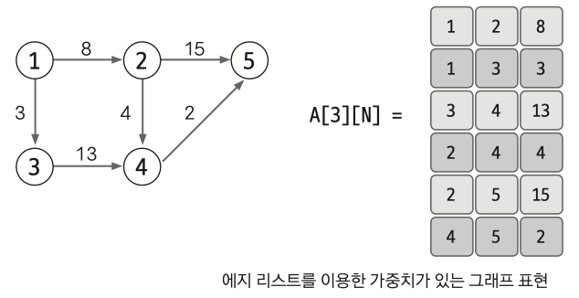
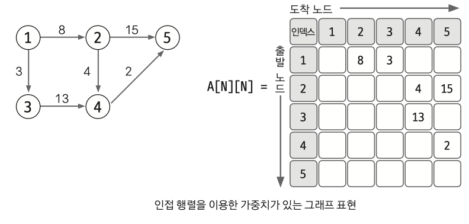
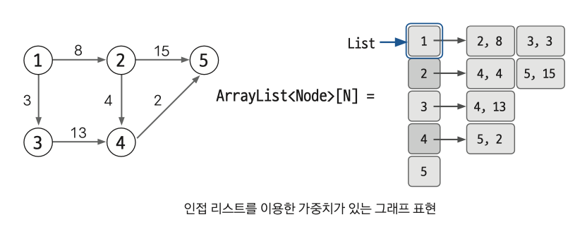

# 08. 그래프
> Keyword : 

## 08-1 그래프의 표현
### 에지 리스트
- 에지를 중심으로 그래프를 표현
- 배열에 출발 노드, 도착노드를 저장하여 에지를 표현
- 또는 출발 노드, 도착 노드, 가중치를 저장하여 가중치가 있는 에지를 표현
- 구현하기 쉽지만 특정 노드와 관련되어 있는 에지 탐색 어려움
- 벨만 포드, 크루스칼 알고리즘에 사용. 노드 중심 알고리즘에는 잘 안 사용.

#### 에지 리스트로 가중치 없는 그래프 표현하기
- 출발 노드, 도착 노드만 표현해서 배열의 행은 2개
- 노드는 여러 자료형 사용 가능
- 방향이 있는 그래프는 순서에 맞게 노드를 배열에 저장하는 방식으로 표현
- 노드를 배열에 저장해서 에지를 표현해서 에지 리스트

#### 에지 리스트로 가중치 있는 그래프 표현하기
- 행을 3개로 늘려서 3번째 행에 가중치 저장
  

### 인접 행렬
- 2차원 배열을 자료구조로 이용하여 그래프 표현 
- 에지 리스트와 다르게 노드 중심으로 그래프 표현
- 구현 쉬움. 두 노드 연결하는 에지의 여부와 가중치값을 배열에 접근하면 바로 확인가능
- 그런데 노드와 관련되어 있는 에지 탐색하려면 N번 접근해야 함.
- 노드 개수에 따라 사용 여부를 판단해야 한다. 노드가 3만 개 넘으면 자바 힙 스페이스 에러 발생.

#### 인접 행렬로 가중치 없는 그래프 표현하기
- 1 -> 2 에지를 1행 2열에 1(가중치 없음) 저장하는 방식으로 표현
- 출발에서 도착으로 향하는 에지가 있다는 표시를 노드 중심으로 한다

#### 인접 행렬로 가중치 있는 그래프 표현하기
- 2에서 5로 향하는 에지의 가중치를 2행 5열에 기록

### 인접 리스트
- ArrayList로 그래프 표현
- 노드 개수만큼 ArrayList 선언
- 구현 복잡하지만 노드와 연결되어 있는 에지 탐색 시간 뛰어남.
- 노드 개수가 커도 공간 효율 좋아서 메모리 초과 에러 미발생
- 코딩 테스트에서 주로 사용 

#### 인접 리스트로 가중치 없는 그래프 표현하기
- 인접 리스트에는 N번 노드와 연결되어 있는 노드를 배열의 위치 N에 연결된 노드 개수만큼 배열을 연결하는 방식으로 표현

#### 인접 리스트로 가중치 있는 그래프 표현하기
- 자료형을 클래스로 사용
- (도착 노드, 가중치)를 갖는 Node 클래스를 선언하여 ArrayList에 사용 

## 08-2 유니온 파인드
- 일반적으로 여러 노드가 있을 때 특정 2개의 노드를 연결해 1개의 집합으로 묶는 union 연산과 두 노드가 같은 집합에 속해있는지 확인하는 find 연산으로 구성
- find 연산 수행 시 재귀 함수에서 나오면서 탐색한 모든 노드의 대표 노드값 이번 연산에서 발견한 대표 노드로 변경!
- union 연산에서 선택된 노드끼리 연결하는 게 아니라 선택된 노드의 대표 노드끼리 연결하기!

### 핵심이론
- union 연산 : 각 노드가 속한 집합을 1개로 합치는 연산.
- find 연산 : 특정 노드 a에 관해 a가 속한 집합의 대표 노드를 반환 

### 유니온 파인드 알고리즘 구현 방법
1. 1차원 배열 이용. 처음에는 노드가 연결되어 있지 않아서 각 노드가 대표 노드.
- 각 노드가 모두 대표 노드라 배열은 자신의 인덱스값으로 초기화
2. 2개의 노드를 선택해 각각의 대표 노드를 찾아 연결하는 union 연산 수행
- 자식 노드로 들어가는 노드값을 대표 노드값으로 변경
- 대표 노드를 찾아 올라가서 그 대표 노드를 연결
3. find 연산은 자신이 속한 집합의 대표 노드를 찾는 연산
4. - 그래프를 정돈하고 시간 복잡도 향상시킴

#### find 연산 작동 원리
1. 대상 노드 배열에 index값과 value값이 동일한지 확인
2. 동일하지 않으면 value값이 가리키는 index 위치로 이동
3. 이동 위치의 index 값과 value 값이 같을 때까지 1,2 반복. 재귀함수로 구현.
4. 대표 노드에 노달하면 재귀 함수 빠져나오면서 거치는 모든 노드값을 루프 노드값으로 변경.